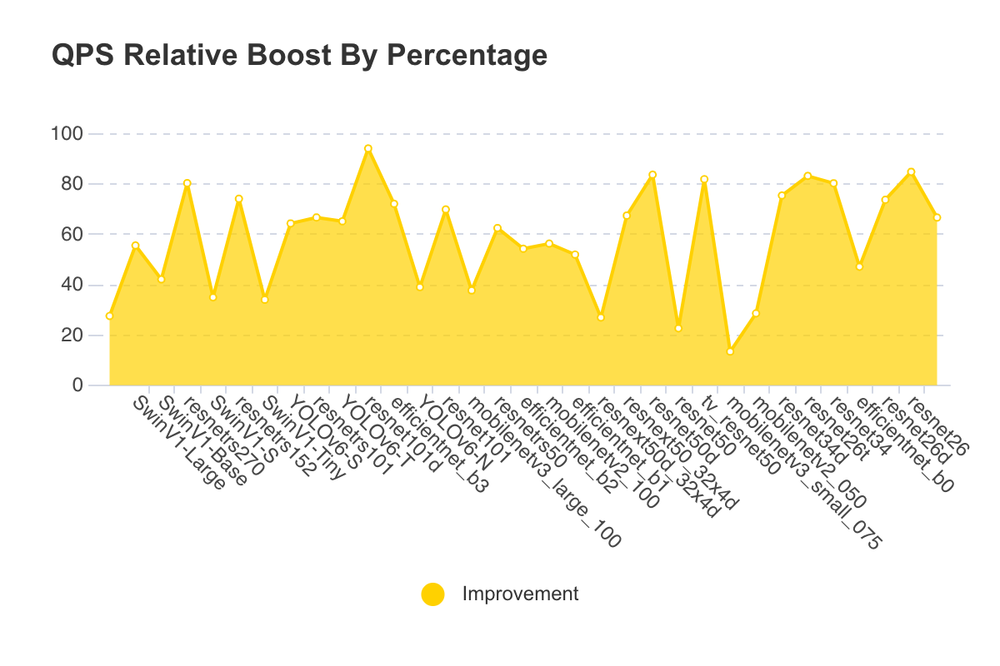
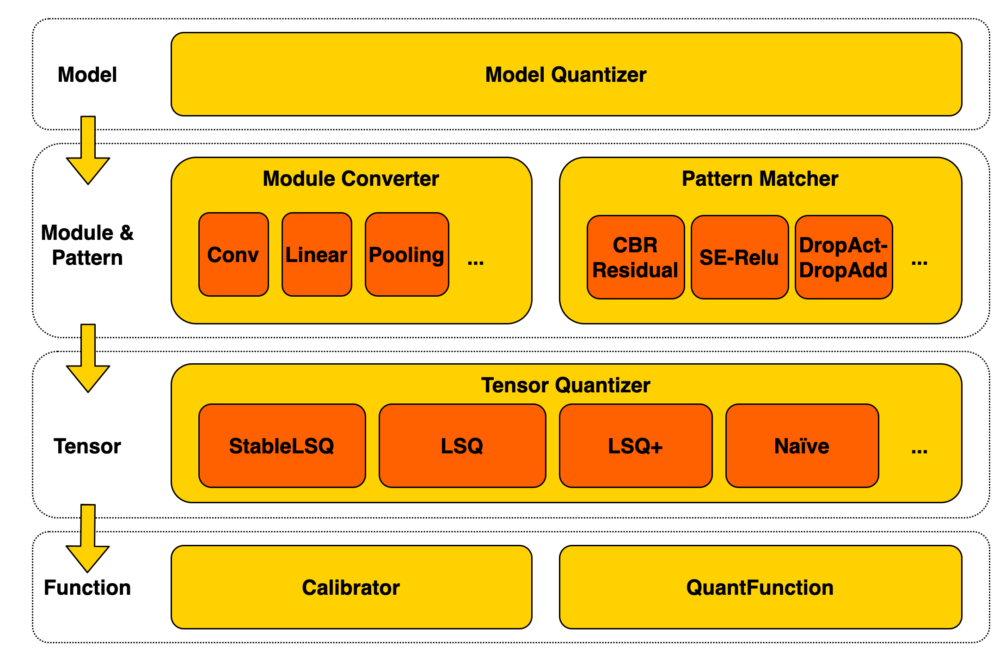

# Meituan PyTorch Quantization

## Overview


Meituan PyTorch Quantization (MPQ) is an Meituan initiative for accelerating industrial application for quantization in vision, NLP, and audio etc. MPQ significantly refactors the software architecture of `pytorch-quantization`, where it takes a top-down approach to automatically parse user-defined models and inserts quantization nodes. MPQ ships with PTQ, Partial PTQ, QAT and a myriad of up-to-date quantization algorithms. The final quantized model is made exportable to onnx in TensorRT's appetite to leverage NVIDIAs high performance GPUs.

## Benchmark

### Quantization Performance on Classical Models 

MPQ Quantization performance is tested with a list of classical models that are mostly used in practice, such as ResNet, MobileNet, EfficientNet, Swin, Bert and YOLOv6. The average accuracy loss is 0.41% compared to their FP16 counterparts.


The following chart uses a batch size of 4, tested on NVIDIA Tesla T4 with TensorRT 8.4.


All models enjoy a substantial QPS boost (58% on average) after quantization.



### Quantization Performance on Timm Models

MPQ well supports timm models where the majority of them has a tolerable accuracy loss if quantized only with PTQ or partial PTQ.


## Install

### Prerequisites

- gcc 5.4+
- python >=3.7
- torch>=1.9

#### From Binaries (Recommended)

```bash
pip install mpq
```

#### From Source (For Develeopment)

```bash
git clone ssh://git@git.sankuai.com/mtmlp/pytorch_quantization.git
cd pytorch-quantization
```

Install PyTorch and prerequisites
```bash
pip install -r requirements.txt
# for CUDA 10.2 users
pip install torch>=1.9.1
# for CUDA 11.1 users
pip install torch>=1.9.1+cu111
```

Build and install pytorch-quantization
```bash
# Python version >= 3.7, GCC version >= 5.4 required
python setup.py install
```

## Quickstart

### PTQ on ResNet50 
```bash
cd examples/timm
sh examples/timm/ptq/scripts/ptq_resnet50.sh
```

### Partial PTQ on ResNet series

```bash
cd examples/timm/
sh partial/scripts/partial_resnet.sh
```
### QAT on MobileNet
```bash
cd examples/timm/
sh qat/scripts/quant_efficientnet_b0_skd.sh
```

### MPQ Architecture

For beginners, one needs to play with Model Quantizer only. For developers, it is made easy enough to inherit the base classes for new features, e.g., Module Converter to support more operations, Pattern Matcher to track new graph patterns, and Tensor Quantizer to adopt novel quantization algorithms etc.



### Auto-Parsing and Q/DQ Node Insertion

The Module Converter and Pattern Matcher are designed to parse the model and convert it into its quantization couterapart.


## Support Matrix

### Training framework
- OpenMMLab
- Timm
- Huggineface

### Bitwidth
- 8bit (exportable)
- 4bit

### Deployment
- TensorRT 7.2+
- TensorRT 8+

## Resources

* Pytorch Quantization Toolkit [userguide](https://docs.nvidia.com/deeplearning/tensorrt/pytorch-quantization-toolkit/docs/userguide.html)
* Quantization Basics [whitepaper](https://arxiv.org/abs/2004.09602)

